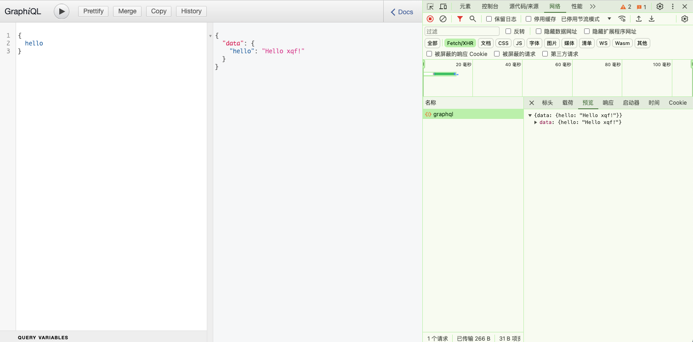
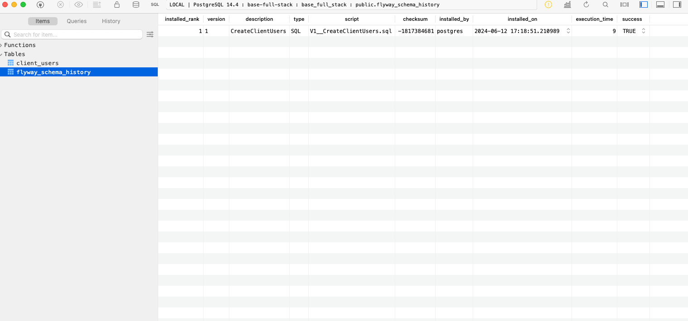

React(next) + tailwindcss + antd + express(GraphQL) + postgressSQL(flyway)

一个用户管理页面（增、删、查、改），包含接口

可以把最终代码上传到新建的一个git仓库

1.React(next)

2. tailwindcss
样式

3. antd
组件库

4. express(GraphQL)
管理前后端数据通信

5. postgressSQL(flyway)
管理数据库版本

6. sequelize: 数据库ORM
连接和操作数据库

