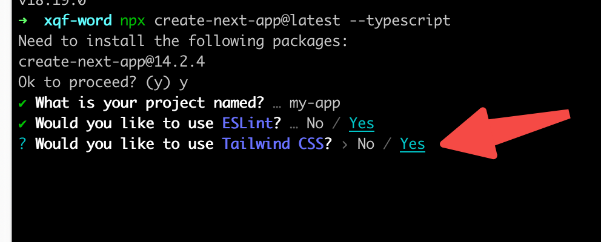
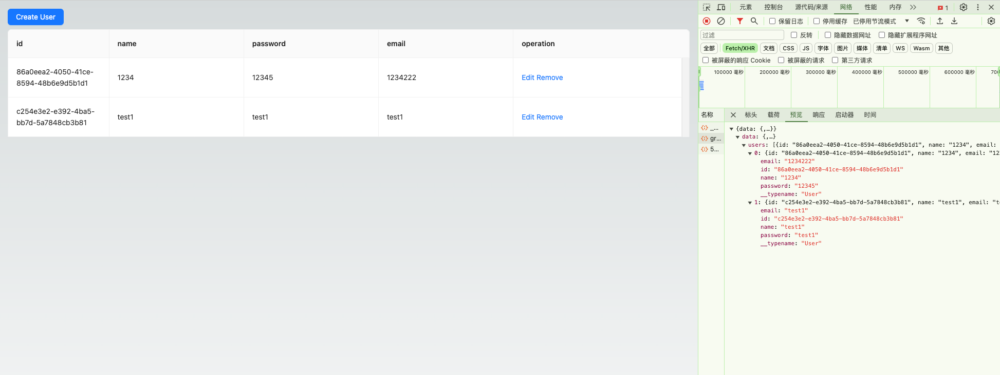
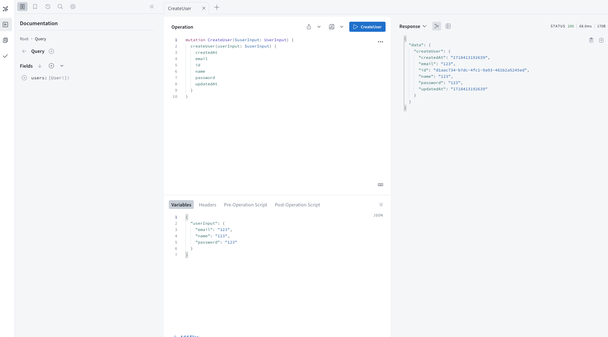

# 前端

### 前端框架：Next.js(version 14)

Next.js 框架最大的优点之一是其支持服务器渲染和静态生成。传统的前端应用程序通常将渲染工作交给客户端，这会导致首屏加载时间较长，并且对搜索引擎的友好性不佳。而 Next.js 框架通过在服务器端进行渲染，能够生成完整的 HTML 内容，并将其直接发送给浏览器，从而大大提高页面的加载速度和性能。

##### 初始化项目

```javascript
1.创建项目
npx create-next-app@latest --typescript

2.安装依赖
yarn install

3.启动项目
yarn run dev
```

### UI 组件库 Antd + 定制化样式 Tailwindcss

Antd 是一个企业级 UI 组件库，它包含丰富的组件和样式，并且易于定制和扩展。Tailwindcss 是一个 CSS 框架，它提供了一组预定义的样式类，可以方便地应用于组件和页面中。通过结合使用 Antd 和 Tailwindcss，可以实现一个具有丰富组件和样式、易于定制和扩展的前端应用程序。

##### 1.引入 UI 组件库

1.创建项目

```javascript
yarn add antd
```

2.改写 pages/\_document.tsx

```javascript
import React from "react";
import { createCache, extractStyle, StyleProvider } from "@ant-design/cssinjs";
import Document, { Head, Html, Main, NextScript } from "next/document";
import type { DocumentContext } from "next/document";
const MyDocument = () => (
  <Html lang="en">
    <Head />
    <body>
      <Main />
      <NextScript />
    </body>
  </Html>
);
MyDocument.getInitialProps = async (ctx: DocumentContext) => {
  const cache = createCache();
  const originalRenderPage = ctx.renderPage;
  ctx.renderPage = () =>
    originalRenderPage({
      enhanceApp: (App) => (props) =>
        (
          <StyleProvider cache={cache}>
            <App {...props} />
          </StyleProvider>
        ),
    });
  const initialProps = await Document.getInitialProps(ctx);
  const style = extractStyle(cache, true);
  return {
    ...initialProps,
    styles: (
      <>
        {initialProps.styles}
        <style dangerouslySetInnerHTML={{ __html: style }} />
      </>
    ),
  };
};
export default MyDocument;
```

3.引入 Tailwindcss
在初始化项目时,勾选使用 Tailwindcss,即可完成依赖包的引入和配置:


### 数据通信：GraphQL + Apollo

GraphQL 是一种高效、灵活的 API 查询语言，它允许客户端精确请求所需数据，通过单一端点访问所有数据，支持实时更新和订阅，以及拥有强类型系统，简化了数据管理和提高了应用程序的性能和可维护性。

Apollo GraphQL 是一个强大的 GraphQL 客户端库，它提供了对 GraphQL 服务的高效、安全访问，支持自动分页、缓存、持久化存储、错误处理和更多高级功能，使得开发复杂的、实时更新的应用程序变得更加简单和高效。

1.引入 GraphQL + Apollo

```javascript
yarn add @apollo/client graphql graphql-tag
```

2.创建并使用 GraphQL 服务的 Provider

```javascript
// 1.构建Provider
import { ReactElement } from "react";
import fetch from "isomorphic-unfetch";
import {
  ApolloClient,
  InMemoryCache,
  ApolloProvider,
  ApolloLink,
  HttpLink,
} from "@apollo/client";
const httpLink = new HttpLink({
  fetch,
  uri: "http://localhost:4000/graphql", // GraphQL服务端地址
});
export const ApolloInfoProvider = ({
  children,
}: {
  children: ReactElement,
}) => {
  const client = new ApolloClient({
    link: httpLink,
    cache: new InMemoryCache(),
  });
  return <ApolloProvider client={client}>{children}</ApolloProvider>;
};

// 2.使用Provider
import { ApolloInfoProvider } from "@/contexts";
import { Users } from "./Users";
export default function Home() {
  return (
    <ApolloInfoProvider>
      <Users />
    </ApolloInfoProvider>
  );
}
```

3.创建 GraphQL 查询,如下查询用户和创建用户的示例

```javascript
import gql from "graphql-tag";
// 1.创建查询接口
export const GET_USERS = gql`
  {
    users {
      id
      name
      email
      password
    }
  }
`;

// 2.创建编辑接口
export const CREATE_USER = gql`
  mutation createUser($userInput: UserInput) {
    createUser(userInput: $userInput) {
      createdAt
      email
      id
      name
      password
      updatedAt
    }
  }
`;
```

4.调用 GraphQL 接口

```javascript
import { useQuery, useMutation } from "@apollo/client";
import { GET_USERS, CREATE_USER } from "api";

const User = () => {
  // 1.调用查询接口
  const { loading, data: info, refetch } = useQuery(GET_USERS);
  // 2.获取编辑接口
  const [CREATE_USER] = useMutation(CREATE_USER);
  // 3.创建用户
  const createUser = useCallback(async () => {
    try {
      await createUser({
        variables: {
          userInput: {
            name: "John Doe",
            email: "johndoe@example.com",
            password: "password",
          },
        },
      });
      // 刷新数据
      refetch();
    } catch (error) {
      console.error(error);
    }
  }, [createUser, form, handleFinish]);

  return (
    <div className="w-full h-full p-4 gap-2 flex flex-col">
      <div>
        <Button type="primary" onClick={createUserHandle}>
          Create User
        </Button>
      </div>
      <Form form={form} component={false}>
        <Table
          loading={loading}
          className="w-full"
          bordered
          dataSource={data}
          rowClassName="editable-row"
          pagination={false}
          scroll={{ y: "80vh" }}
        />
      </Form>
    </div>
  );
};
```
示例如下：


# 后端

### 后端框架：TS + Express
Express.js是一个轻量级、灵活的Node.js web应用框架，它提供了快速路由、中间件支持、模板引擎集成等功能，使得开发RESTful API和web应用程序变得简单快捷，同时拥有强大的生态系统和社区支持。

1.引入 Express
```javascript
yarn add express
```

2.创建 Express 应用
```javascript
import express from "express";

const startServer = async () => {
  const app = express();
  app.listen(4000, () => {
    console.log("Server is now running on http://localhost:4000");
  });
};
startServer();
```

### 数据管理：PostgresSQL + Flyway + Sequelize
Flyway是一个开源的数据库迁移工具，它以SQL脚本的形式管理数据库版本控制，支持多种数据库平台，提供了自动化部署、回滚能力、版本控制和报告等功能，使得数据库迁移过程更加可控、可追踪和高效。

Sequelize是一个基于Promise的Node.js ORM（对象关系映射）库，它支持PostgreSQL、MySQL、MariaDB、SQLite和MSSQL等多种数据库，提供了模型定义、关系设置、事务管理等功能，使得在Node.js环境下进行复杂数据库操作更加直观和高效。

##### 一、使用Flyway管理数据库版本

1.引入 node-flyway
```javascript
yarn add node-flyway
```

2.创建数据库表sql脚本
```sql
CREATE TABLE client_users (
    id VARCHAR(255) PRIMARY KEY,
    name VARCHAR(255) NOT NULL,
    password VARCHAR(255) NOT NULL,
    status VARCHAR(255) NOT NULL,
    email VARCHAR(255) NOT NULL,
    created_at TIMESTAMP NOT NULL DEFAULT NOW(),
    updated_at TIMESTAMP NOT NULL DEFAULT NOW()
);
```

3.创建 migrate 脚本
```javascript
const { Flyway } = require('node-flyway');
const flyway = new Flyway(
    {
        url:"jdbc:postgresql://localhost:5432/base_full_stack",
        user:"postgres",
        password:"password",
        defaultSchema: "public",
        // sql脚本路径
        migrationLocations: ["src/db/migrations/sql"]
    }
);
flyway.migrate().then((response) => {
    if(!response.success) {
      throw new Error(`Unable to execute migrate command.`, response);
    }
    else {
      console.log(`Successfully executed migrate command:`,response)
    }
});
```

4.执行 migrate 脚本
```javascript
// package.json
"scripts": {
    "migration": "node ./src/db/migrations/index.js",
  },
```

##### 二、使用Sequelize连接和操作数据库

1.引入 sequelize
```javascript
yarn add sequelize @types/sequelize
```

2.创建数据库表结构实例
```javascript
import { DataTypes } from "sequelize";
export const defineClientUsers = (sequelize) => {
  const clientUsers = sequelize.define(
    "clientUsers",
    {
      id: {
        type: DataTypes.STRING,
        primaryKey: true,
        defaultValue: DataTypes.UUIDV4,
      },
      name: {
        type: DataTypes.STRING,
        allowNull: false,
      },
      createdAt: {
        type: DataTypes.DATE,
        allowNull: false,
      },
      updatedAt: {
        type: DataTypes.DATE,
        allowNull: false,
      },
    },
    {
      tableName: "client_users",
      underscored: true,
    }
  );
  return clientUsers;
};

// 引入实例
export class SequelizeDb {
  constructor() {
    const sequelize = new Sequelize(DATA_BASE_URI);
    this.sequelize = sequelize;
    this.Sequelize = Sequelize;
    this.ClientUsers = defineClientUsers(sequelize);
  }
}
```

3.创建数据库表 modal 实例
```javascript
import { DATA_STATUS } from "../../constants";

export type User = {
  id: string;
  name: string;
  email: string;
  password: string;
  createdAt: Date;
  updatedAt: Date;
};
export type UserInputData = {
  name: string;
  email: string;
  password: string;
};

export class ClientUsers {
  constructor(sequelizeDb) {
    this.sequelizeDb = sequelizeDb;
  }
  async findOneById(id: string) {
    try {
      const user = await this.sequelizeDb.ClientUsers.findOne({
        where: {
          id,
          status: DATA_STATUS.available,
        },
      });
      if (user) {
        let final = user.toJSON();
        return final;
      }
    } catch (error) {
      console.log("error:", error);
    }
  }
  // 创建用户
  async create(data: UserInputData) {
    try {
      const info = {
        name: data.name,
        email: data.email,
        password: data.password,
        status: DATA_STATUS.available,
      };
      const newUser = await this.sequelizeDb.ClientUsers.create(info);

      return this.findOneById(newUser.id);
    } catch (error) {
      console.log("error:", error);
    }
  }
}

// 引入实例
export class Models {
  constructor(sequelizeDb) {
    this.sequelizeDb = sequelizeDb;
    this.clientUsers = new ClientUsers(sequelizeDb);
  }
}
```

4.创建数据库操作函数
```javascript
import { Models } from "./models";
import { SequelizeDb } from "./sequelize-db";

const instances = {};

// 获取数据库信息
export async function getDb(instanceAlias = "default") {
  const instancePromise = instances[instanceAlias];
  if (!instancePromise) {
    throw new Error("db instance must be created first");
  }
  const { models, sequelizeDb } = await instancePromise;
  return { models, sequelizeDb };
}

// 初始化数据库连接
async function initDb() {
  const sequelizeDb = new SequelizeDb();
  const models = new Models(sequelizeDb);
  return { models, sequelizeDb };
}

// 检测数据库是否已连接
export function makeDb(instanceAlias = "default") {
  if (instances[instanceAlias]) {
    throw new Error(`db instance ${instanceAlias} already made`);
  }
  const dbPromise = initDb();
  instances[instanceAlias] = dbPromise;
  return true;
}
```

### 数据通信：GraphQL + Apollo

1.引入 GraphQL + Apollo
```javascript
yarn add apollo-server apollo-server-express
```

2.创建 schema, 用于定义接口的数据结构
```javascript
import { gql } from "apollo-server-express";

export const typeDefs = gql`
  type Query {
    users: [User!]!
  }
  type Mutation {
    createUser(userInput: UserInput): User!
    updateUser(userId: String!, updateUser: UserInput): User!
    deleteUser(userId: String!): Boolean!
  }
  type User {
    id: String!
    email: String!
    name: String!
    password: String
    createdAt: String!
    updatedAt: String!
  }
  input UserInput {
    email: String!
    name: String!
    password: String!
  }
`;
```

3.创建 resolvers, 用于响应请求
```javascript
import { UserInputData } from "src/db/models/clientUsers";

// 查询接口
const UserQueries = {
  users: async (_, args, { models }) => {
    try {
      const users = await models.clientUsers.findAll();
      return users;
    } catch (err) {
      throw err;
    }
  },
};

// 修改接口
const UserMutation = {
  createUser: async (
    _,
    { userInput }: { userInput: UserInputData },
    { models }
  ) => {
    try {
      const user = await models.clientUsers.create(userInput);
      return user;
    } catch (error) {
      throw error;
    }
  }
};

// 合并 resolvers
const rootResolver = {
  Query: {
    ...UserQueries
  },
  Mutation: {
    ...UserMutation
  }
};
```

4.应用 GraphQL
```javascript
import { ApolloServer } from "apollo-server-express";
import express from "express";
import { getGraphqlInfo } from './graphql'

export const makeApp = async(models) => {
  const app = express();

  // 实例化 GraphQL
  const graphqlInfo = getGraphqlInfo(models);
  const server: ApolloServer = new ApolloServer(graphqlInfo);
  app.use(function (req: any, _, next) {
    req.models = models;
    next();
  });
  await server.start();
  server.applyMiddleware({ app });

  return app;
};
```
示例如下:


### 完整Demo连接如下：
[https://github.com/xufuping/base-full-stack](https://github.com/xufuping/base-full-stack)